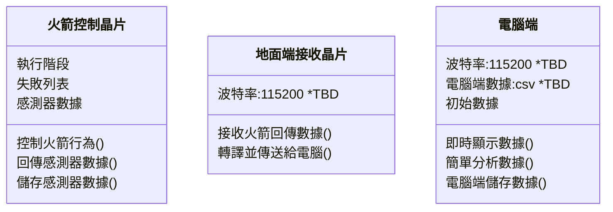
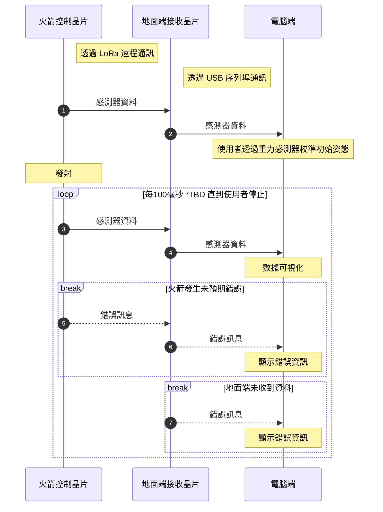

# rocket_system_ground_side
###### *version-v3.4* 
---
## 簡介
- 火箭系統的地面端程式
- 使用 PyQt 製作 GUI
- 從序列埠讀取資料並即時繪製圖表與進行簡單分析
- 透過 OpenGL 即時繪製火箭姿態
- 即時繪制數據折線圖
- 顯示火箭任務階段
- 透過 Folium 繪製火箭經緯度座標 *TBD
- 可能有一半的程式碼是 ai 寫的（？
 
## 序列埠資料格式

純 ASCII、空格分隔、以 `\r\n` 結尾。每個欄位都有大寫 Key 前綴緊貼數值（沒有 `=`）：

```
T28386 SQ42 AX+0.007 AY+0.026 AZ+0.978 GX+6.09 GY-1.05 GZ-2.80 P997.92 RH-0.1 KH-0.1 VZ+0.00 GA0.98 ST:0 MOD:F GPS:1,8 C:0 VF8.12 VA7.98 LAT+22.17483 LON+120.89272
```

事件訊息另走 `MSG <LEVEL> <CONTENT>\r\n` 一行。

📖 **完整欄位定義、狀態碼、模組旗標、截斷幀處理見 [`doc/telemetry_format.md`](/doc/telemetry_format.md)。**
C 語言版契約在火箭端 repo 的 `shared/protocol.h`。

> [!CAUTION]
> 早期依 **microbit** 設計的 `telemetry:{json}` 格式已於 2026-07 完全廢棄，
> 解析器不再接受。此節在 2026-07-30 前仍記載該格式。

## 執行

1. 安裝 `requirements.txt` 中的依賴
2. 在 `settings.json` 設定兩個頻道的 COM port（ZMQ port 不用動）
3. 執行 `run_persist_backend.bat`

`.bat` 會先探測 15555 / 15556，只啟動還沒在跑的 daemon，再開 GUI。
GUI 關掉後 backend daemon 仍會繼續收資料寫 CSV —— 這是多進程架構的重點：
**GUI 崩潰不會弄丟遙測**。

> [!IMPORTANT]
> `settings.json` 的 COM port 是**機器專屬**的，但目前有被版控。
> 從對方 fork 合併過來時會被覆蓋，發射前務必確認一次。

> [!NOTE]
> 地面接收硬體是 `rocket-system/firmware-ground`（STM32F411 + E22-900T22D），
> 純透傳橋接：LoRa → USB CDC，不解析封包。
> 早期的 micro:bit 方案（`microbit-test.hex`）已不再使用。

## 截圖


## 運行邏輯
### 各端職責

### 流程


> [!NOTE]  
> 錯誤回報功能尚未實作
>
> 使用者停止功能向未實現
>

## 更新

> [!NOTE]
> **編號有兩套，不連續。** `1.0.x` 是 micro:bit 原型時代的內部編號；
> 改接真實航電之後改用 GitHub Release 標籤 **`v3.x`**
> （已發布的 `v3.0-兩通道獨立` = `a39399d`，2026-07-20）。
> 以下依 release track 記錄，`v3.0` 以前的 `1.0.x` 保留為歷史。

### v3.4
```
v3.4  (2026-07-30)
合併 jx06T 的重複 daemon 防護（啟動前探 port、bind 失敗給人話）
protocol.h / telemetry_format.md / rocket_side_requirements.md 對齊實際韌體
  · ST 由 12 狀態修正為 5 狀態（原本會把「正在放傘」讀成「點火」）
  · MOD 全正常由 E 改正為 F；C 欄正名為「開傘條件」
  · rocket_side_requirements 的 ARM 規則：飛行中其實不需要先 /arm
README 序列埠格式與執行步驟改寫（原本仍是 micro:bit JSON 時代）
```

### v3.3
```
v3.3  (2026-07-27 ~ 07-28)
截斷封包整幀拒收（缺 ST/MOD/GA 即丟棄，防假 stage 0 觸發誤確認）
GPS 宣稱定位但無座標 → 降級 NO_FIX（不再標成台北）
ZMQ PUB socket 加共用 RLock（遙測與 log 兩條路徑共用一顆 socket）
連線送達率顯示（用 SQ 序號算，含重開機偵測）
電量告警修復（原本被提早 return 擋掉，是死碼）
操作列改 FlowLayout，視窗變窄時自動換行不再壓爛版面
開傘確認不再被「過期狀態」滿足（stage 邊緣偵測）
REJECT 只清真正被拒的那道指令（原本一句 RECAL 拒收會誤清開傘指令）
/setch 頻段外（非 CH70-74）警示
```

### v3.2
```
v3.2  (2026-07-24 ~ 07-26)
遠端 RECAL：一鍵重設火箭端氣壓零點 + 地面端姿態歸零
火工品閉環：下行開傘確認、ARMED 回讀、格式錯誤狀態、VID/PID 辨識
/setch 遠端換 LoRa 頻道
保險絲 / 武裝開關電壓顯示（VF / VA）
切換焦點頻道不再摧毀另一頻道的圖表與統計
火工品按鈕在確認態不再變寬
兩條重複狀態列合併為一行
```

### v3.1
```
v3.1  (2026-07-21 ~ 07-22)
雙板熱備援：/arm_all /dpl_all /abg_all 廣播到兩塊板
ch2 實際上線（原本 _all 只打得到一塊板）
部分發火告警措辭修正（單板成功仍能安全落地）
雙頻道高度曲線同框比較
requirements.txt 補 PyOpenGL
```

### v3.0
```
v3.0  (2026-07-19 ~ 07-20)   ← 已發布 release「兩通道獨立」
改接真實航電：LoRa communicator + 自動重連
遙測改純 ASCII 直解析（JSON 格式廢棄）
ZMQ 多進程架構（GUI 崩潰不影響遙測儲存）
地圖視覺化、飛行階段追蹤、mock 遙測工具
```

### 1.0（micro:bit 原型時代）
```

1.0.5
地圖顯示實現
姿態顯示 Bug 修復
解決地圖與姿態顯示之衝突

1.0.4
姿態顯示實現
折線圖更新
Bug 修復

1.0.3
折線圖繪製多條線實現
狀態列表完成
log 區塊整合
底部狀態欄完成
GUI 更新 

1.0.2
折線圖繪製實現
狀態列表實現

1.0.1
序列埠通訊方法完成
觀察者模式實現
本地儲存模塊完成

1.0.0
初步架構完成
初步 GUI 布局完成

```

## 待辦

### 已完成（2026-07-30 逐項對照程式碼查證）
- [x] 折線圖 x 軸用實際時間 — `line_chart.py` 的 `time_axis`
- [x] 改由角速度推算目前姿態 — Chart 3 同時畫 Pitch/Roll/Yaw 與 GX/GY/GZ
- [x] 初始狀態透過重力感測器校準姿態 — 操作列「校準」鈕（同時重校火箭端氣壓零點）
- [x] 飛行過程極值紀錄 — `max_height` / `max_total_accel` / `max_deviation_angle`
- [x] 飛行過程事件時間紀錄 — `add_event_marker()`
- [x] 重力資料作圖 — Chart 2（GA 總加速度 + AX/AY/AZ）
- [x] 地圖功能 — `visualizers/location_displayer.py`（自繪，未採用 folium）
- [x] 本地儲存格式 — CSV（`storage/csv_storage.py`）
- [x] 錯誤回報功能 — 火箭端 `MSG <LEVEL>` 事件 + REJECT 分派 + 紅色告警
- [x] 使用者停止功能 — `/disconnect` 指令
- [x] 讀取序列埠未捕獲錯誤導致視窗退出 — `stop_event` + 重連迴圈，
      並修掉 `FileNotFoundError` 後 break 造成 100% CPU 的鎖死
- [x] `communicator.py` sentinel 毒化 — `start()` 改為每次重建 `data_queue`。
      舊碼在 GUI 改 COM port / 鮑率 / 重連後有約 10% 機率讓解析執行緒無聲死亡
      （回歸測試 `tests/test_sentinel_poisoning.py`）
- [x] 折線圖分析 — 即時統計標籤（最大高度 / 最大偏角 / 當前偏角 / 垂直速度）、
      階段事件自動打標（三張圖 + 地圖同步，`main_window.py:994`）、
      雙頻道疊圖比較（`alt_overlays`）

### 進行中 / 未完成
- [ ] **`settings.json` 不該入庫** — 機器專屬設定卻被版控，兩人各改各的
      COM port 會在每次合併互相覆蓋。應改成 gitignore + `settings.example.json`
- [ ] `doc/architecture.md` 仍描述「JSON 格式」與 micro:bit，需同步改寫
- [ ] `doc/1.png` ~ `3.png` 是舊版 GUI 截圖
- [ ] `doc/health_check_report.md` 列的高風險項目部分已修（ZMQ 執行緒安全、
      重連 CPU 鎖死），需標注哪些還在

### 發射前必辦（火箭端 repo）
- [ ] 關閉 `REMOTE_CMD_UNRESTRICTED` 後重編重燒 — 目前火工品指令**沒有任何閘門**
- [ ] 安裝 arming 開關
- [ ] 發射前最後一刻下 `#CMD:RECAL_SALT5566#` — 氣壓基準漂 2.4 hPa
      就會讓 C 備援的 20m 地面保護失效
